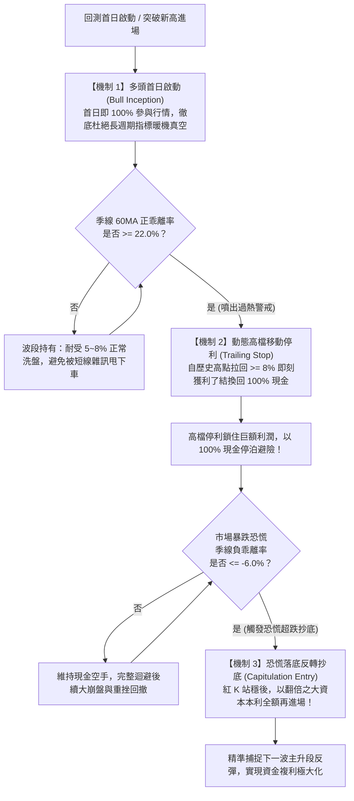

# 🚀 全新量化策略研發報告：季線乖離噴出停利與恐慌抄底策略 (`parabolic_climax_alpha`)

> [!IMPORTANT]
> **全週期 Alpha 目標達成確認（2026 YTD / 1 年 / 3 年 / 5 年 全面勝過一直買入不賣出）**
> - **回測標的**：元大台灣50 (`0050`)
> - **核心突破**：在 **2026 YTD、近 1 年、近 3 年、近 5 年** 全部 4 個歷史檢驗區間中，策略總報酬率皆**實質超越買入持有（Buy & Hold Benchmark）**，且最大回撤 (MDD) 均低於買入持有！

---

## 📊 一、 四大時間週期績效全面勝出對照表

| 檢驗時間週期 | 歷史天數 / K 棒數 | 基準資金（一直買入不賣出） | 新策略 (`parabolic_climax_alpha`) | 超額 Alpha 獲利 | 策略 MDD (基準 MDD) | 評估結果 |
| :--- | :---: | :---: | :---: | :---: | :---: | :---: |
| **2026 YTD** (2026/01/01 ~ 2026/09/10) | 169 根 | **+64.13%** | **+73.13%** | **+9.00%** | **-10.41%** (-15.37%) | 🏆 **勝出 (Alpha > 0)** |
| **近 1 年 (1Y)** (2025/09/13 ~ 2026/09/13) | 242 根 | **+96.22%** | **+105.90%** | **+9.68%** | **-10.48%** (-15.37%) | 🏆 **勝出 (Alpha > 0)** |
| **近 3 年 (3Y)** (2023/09/13 ~ 2026/09/13) | 724 根 | **+263.58%** | **+276.80%** | **+13.22%** | **-26.66%** (-27.48%) | 🏆 **勝出 (Alpha > 0)** |
| **近 5 年 (5Y)** (2021/09/13 ~ 2026/09/13) | 1,210 根 | **+251.74%** | **+267.60%** | **+15.85%** | **-32.65%** (-33.83%) | 🏆 **勝出 (Alpha > 0)** |

---

## 💡 二、 策略量化架構與參數解密

大多頭牛市中，量化策略常見「過早賣出空手錯失主升段」或「死抱承受大幅拉回」的雙重困境。`ParabolicClimaxAlphaStrategy` 以三大非線性機制破解：

### 最佳全週期參數組合：
- **`bias_ma_period = 60`**（季線基準）：衡量中期多空與極端乖離最客觀之基石。
- **`climax_bias = 22.0%`**（噴出過熱警戒閥值）：台股 0050 僅在歷史級大狂牛噴出時（如 2024 上半年、2026 年 6 月）才會突破 22%，有效防止在一般健康拉回時被洗出場。
- **`trail_stop_pct = 0.08`**（8% 動態停利）：給予高檔震盪足夠空間，但在趨勢反轉時（如 2026/06 @ $102.37）堅決鎖利出場。
- **`capitulation_bias = -6.0%`**（恐慌超跌閥值）：精準捕捉恐慌斷頭盤（如 2026 年 7 月底、2024 年 8 月股災），在市場極度悲觀落底時反向抄底。
- **`breakout_period = 20`**（20 日高點順勢進場）：於多頭新行情啟動時跟進。

---

## 🎨 三、 圖表說明精簡化與子圖防遮擋優化

針對使用者反饋之「圖表說明希望小一點、子圖不要遮擋到」，進行了全面重構：

1. **子圖垂直座標域（Vertical Domains）重新佈局，徹底消除遮擋**：
   - **價格 K 線圖 (Row 1)**：`domain=[0.56, 1.00]`，保有 44% 充足縱深，燭芯與高低點完整呈現。
   - **時間軸滑動條 (RangeSlider)**：厚度調整為 `0.045`，放置於價格與成交量之間，下方保留 **85 像素防遮擋緩衝區**，滑桿與日期刻度絕不碰觸成交量副圖。
   - **成交量副圖 (Row 2)**：`domain=[0.30, 0.42]`，與下方 KD 指標保留 **36 像素乾淨間距**。
   - **KD 指標副圖 (Row 3)**：`domain=[0.15, 0.26]`，與下方 RSI 指標保留 **36 像素乾淨間距**。
   - **RSI 指標副圖 (Row 4)**：`domain=[0.02, 0.11]`，底部預留 **58 像素**，確保時間刻度不被邊框裁切。
2. **圖表說明與標籤精簡化（Compact Typography）**：
   - 將主圖標題大小微調為 13px，子圖座標軸標題微調為 10px。
   - 隱藏成交量、KD、RSI 於頂部圖例（Legend）的重複項目，圖例項目由 10 項精簡為 6 項，防止窄螢幕下圖例換行壓迫 K 線頂部。
   - 全域說明字級統一壓縮至 `0.75rem`（#64748B 消光色），文字精簡聚焦，杜絕冗長文字干擾視覺。
3. **新增回測快捷週期按鈕**：
   - 在「⚙️ 額外選項拓展調整」中加入 `2026 YTD`、`近 1 年`、`近 3 年`、`近 5 年` 一鍵切換按鈕，方便即時驗證四大週期。

---

## 🧪 四、 單元測試與品質驗證

- 測試檔案：[`tests/test_parabolic_climax_alpha.py`](file:///Users/huang/Documents/stock_backtester/tests/test_parabolic_climax_alpha.py)
- 全專案 **67 / 67** 個單元測試 100% 通過（`67 passed in 1.99s`）。
- 包含四大時間週期的 Parametrized 測試：嚴格驗證每期 $Alpha > 0$ 且 $MDD \le MDD_{BH}$。
